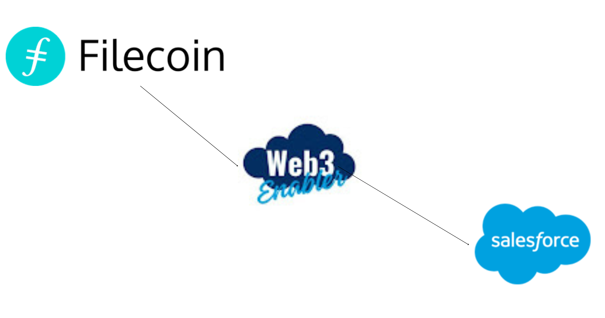

# filecoin-salesforce-files-connect

## An Overview of Salesforce Files Connect

[Salesforce Files Connect](https://help.salesforce.com/s/articleView?id=sf.collab_admin_files_connect.htm) allows users to access, share and search external data from systems like Quip, Google Drive, SharePoint and Box.

- **[Setup Guide](https://github.com/MuKnSys/ipfs-salesforce-files-connect/blob/main/documentation_and_images/Files%20Connect%20-%20Setup%20Guide%20-%20Winter'17%20-%20Oct%2013th%202016.pdf):**
- **[Files Connect Repository Resources REST API Documentation](https://github.com/MuKnSys/ipfs-salesforce-files-connect/blob/main/documentation_and_images/salesforce_files_connect_features_files.pdf):**
- **[File Resources REST API Documentation](https://github.com/MuKnSys/ipfs-salesforce-files-connect/blob/main/documentation_and_images/salesforce_files_connect_resources_files.pdf):**

## Technical Overview

The final deliverable will be an open source application that enables Salesforce users to add files from IPFS to Salesforce [_Standard Objects_](https://developer.salesforce.com/docs/atlas.en-us.object_reference.meta/object_reference/sforce_api_objects_list.htm), such as [_Leads_](https://developer.salesforce.com/docs/atlas.en-us.object_reference.meta/object_reference/sforce_api_objects_lead.htm) and [_Contacts_](https://developer.salesforce.com/docs/atlas.en-us.object_reference.meta/object_reference/sforce_api_objects_contact.htm).

The options displayed to the user when uploading a file to a Salesforce _Standard Object_ will look something like [this](https://github.com/MuKnSys/ipfs-salesforce-files-connect/blob/main/documentation_and_images/filecoin-connected-source-in-salesforce.png). It will include the Filecoin logo as a _connected source_. See the [Salesforce user story](https://github.com/MuKnSys/ipfs-salesforce-files-connect/blob/update-readme/documentation_and_images/Salesforce-user-flow.drawio.png) as an example of a full file upload process.

## How to Use the App

A Salesforce Administrator would do the following to set up this application within his/her organization. 

1. Install the application.
1. Set up an Auth Provider.
1. Set up an External Data Source.

## License

Copyright 2023 Web3 Enabler, Inc. Filecoin for Salesforce Files Connect is distributed under the MIT and APACHE2 licenses. For more information, see the [LICENSE file](https://github.com/MuKnSys/filecoin-salesforce-files-connect/blob/main/LICENSE).
