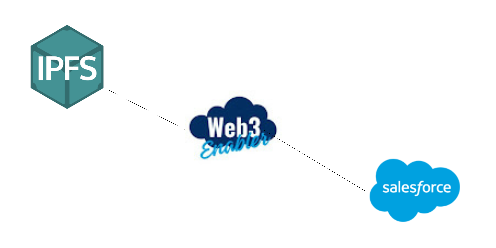

# ipfs-salesforce-files-connect

## An Overview of Salesforce Files Connect

[Salesforce Files Connect](https://help.salesforce.com/s/articleView?id=sf.collab_admin_files_connect.htm) allows users to access, share and search external data from systems like Quip, Google Drive, SharePoint and Box.
